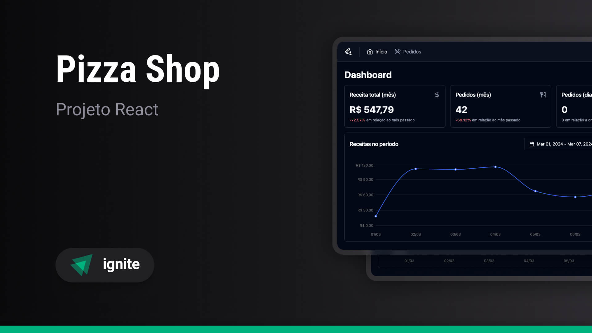

> Ignite - Projeto #7

# Ignite Pizza Shop

## Sobre o projeto

O projeto Ignite Pizza Shop é uma aplicação para gerenciamento de pizzaria (dashboard de administrador), focando em:

- Conceitos do React
- Comunicação com APIs via requisições HTTP
- Testes unitários e end-to-end

As Funcionalidades incluem:

- Cadastro de estabelecimento, persistindo no banco de dados
- Login utilizando magic link (passwordless)
- Dashboard com métricas de vendas por dia e por mês, além de gráficos com vendas diárias e produtos mais populares
- Listagem de pedidos, com filtros por id, nome do cliente e status do pedido
- Ações do pedido, mudando o estado atual (pendente, cancelado, em processo, em entrega ou entregue)
- Detalhes do pedido, incluindo listagem de produtos
- Tema claro e escuro

## Tecnologias Utilizadas

> Este projeto não segue a mesma organização do curso, mas sim a estrutura que eu utilizo em projetos da empresa e/ou projetos freelances

- Frontend:
  - React
  - TypeScript
  - Vite
  - React Router Dom
  - React Query
  - Next-Auth
- Styling:
  - Tailwind CSS
  - Shadcn UI
- Form Management:
  - React Hook Form
- Validation:
  - Zod
- Linting and Formatting:
  - Eslint
  - Prettier
- Testing:
  - Vitest
  - Playwright
